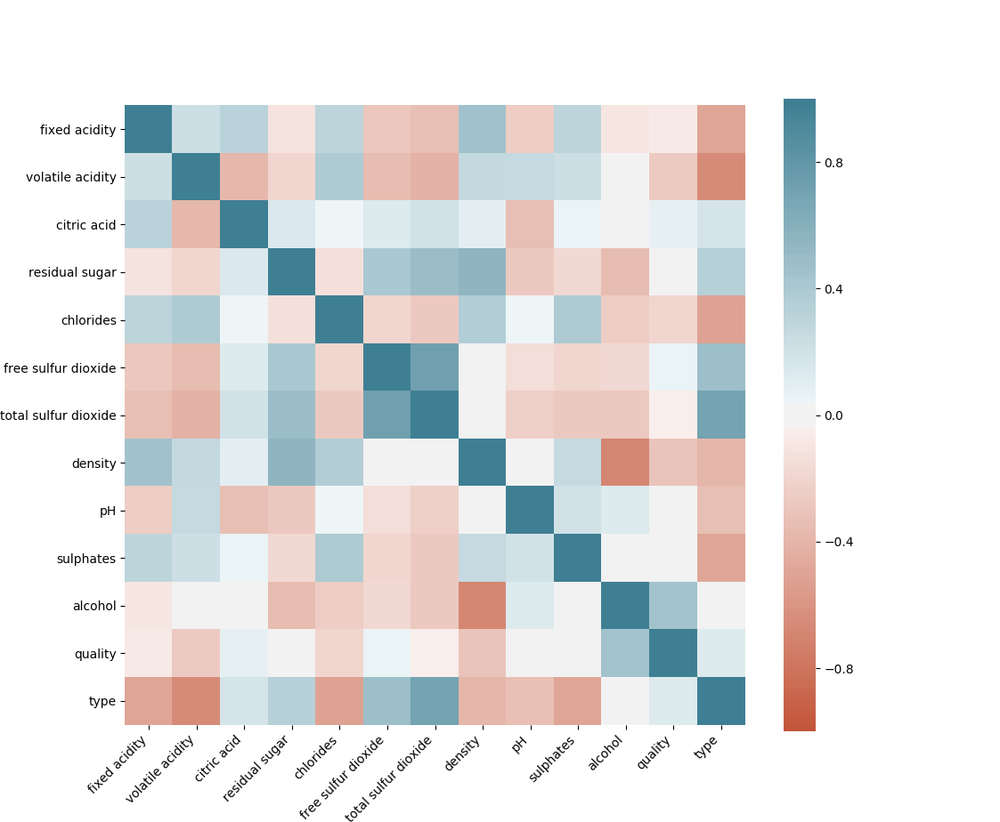

# Wine Quality Prediction

Neural network model to predict the quality of red and white wine using Keras and scikit-learn

## Wine Type Classification
### Feature Selection
Since each dataset comes with 12 features, not all are correlated with the type of wine, therefore it is important to select features that we are interested in by constructing a correlation matrix.

- volatile acidity
- total sulfur dioxide
- fixed acidity
- chlorides
- free sulfur dioxide
